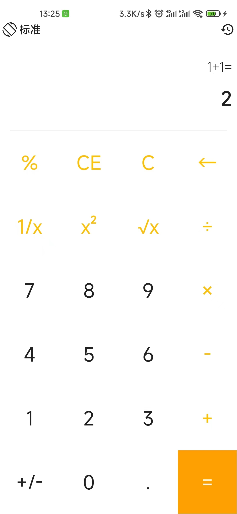
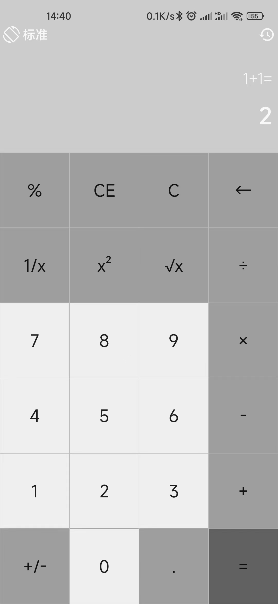
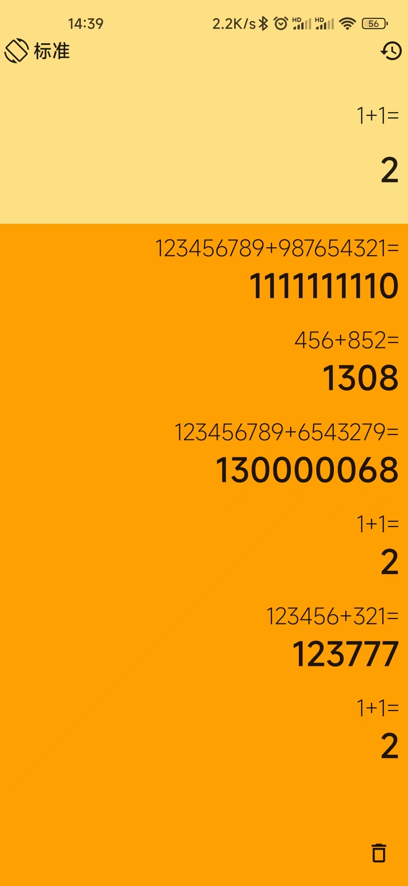
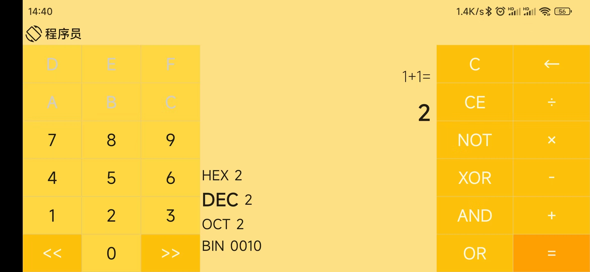
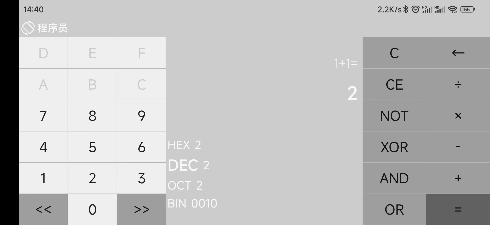
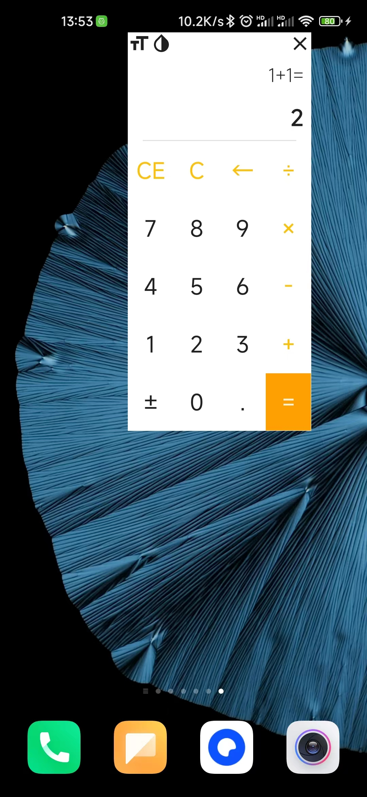
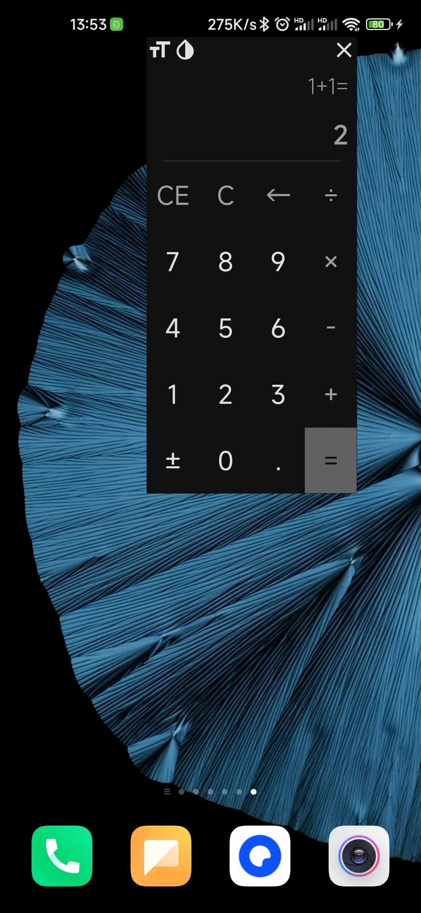

# Calculator-Compose

这是一款完全使用 Jetpack Compose 实现的计算器 APP。

## 功能特性

| 是否支持 | 功能 |
| :----: | :------: |
| ✔ | 基础四则运算（标准、程序员） |
| ✔ | 无限输入（标准） |
| ✔ | % , 1/x , x² , √x 扩展运算（标准）|
| ✔ | 运算过程历史记录（标准） |
| ✔ | 二进制、八进制、十进制、十六进制随意切换并实时换算（程序员） |
| ✔ | 位运算：左移、右移（程序员） |
| ✔ | 逻辑运算：AND、OR、NOT、XOR（程序员） |
| ✔ | 无限连续计算（标准、程序员） |
| ✔ | 支持悬浮窗计算器，可调整位置、大小、透明度（标准） |
| ✔ | 符合人体握持习惯的横屏键盘 |
| ✔ | 旋转手机自动切换标准和程序员键盘 |
| ✔ | 深色模式 |
| ✔ | 酷炫的数字动效与振动反馈 |

**注意：**

1. 标准模式使用 BigDecimal 计算，所以理论支持无限位数数字计算
2. 程序员模式因为涉及到二进制计算，所以采用 64 位储存大小，故不支持无限位数计算
3. 程序员模式不支持带小数运算，如果运算结果有小数，则会直接抛弃小数部分

## 截图

| 浅色  | 深色 |
| :----: | :----: |
|    标准模式 |    标准模式 |
|    历史记录 |    历史记录 |
|    程序员模式 |    程序员模式 |
|    悬浮窗 |    悬浮窗 |

## 其他
处理逻辑参考了 *微软计算器*

布局参考了 *小米计算器* 与 *微软计算器*

实现细节：[使用 Jetpack Compose 实现一个计算器APP](http://www.likehide.com/blogs/android/using_compose_made_a_calculator_app/)
